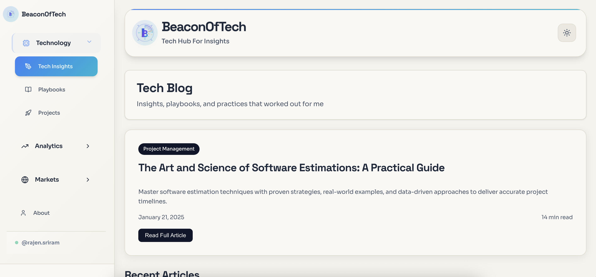

# 📈 BeaconOfTech - Personal Tech Insights Platform by Sriram Rajendran



A **personal, non-commercial platform** by **Sriram Rajendran** for sharing tech insights, innovation analysis, and educational content. This project serves as a personal branding platform and knowledge-sharing hub, featuring educational tech blogs, playbooks, projects, and learning resources - built with Astro, React, and Tailwind CSS.

## 👨‍� **About the Author**

**Sriram Rajendran** - Technology enthusiast and knowledge sharer. This platform represents my personal journey in exploring and documenting technology innovations, insights, and learning experiences.

## 🌐 **Live Platform**

**Personal Platform:** `https://beaconoftech.com/`

## ✨ **Platform Features**

### **Educational Content**
- **Tech Insights Blog** - Personal articles on technology trends and innovations
- **Technical Playbooks** - Step-by-step guides and best practices
- **Project Showcases** - Personal projects and learning experiments
- **Knowledge Sharing** - Educational resources and research materials

### **Analytics & Tools**
- **Stock Portfolio Analysis** - Educational investment analysis tools
- **Market Watchlist** - Track and monitor favorite stocks
- **Stock Screener** - Filter and discover investment opportunities
- **Chart Pattern Recognition** - Technical analysis education
- **Market Data Visualization** - Real-time market insights

### **Platform Purpose**
- **Personal Branding** - Establishing professional presence
- **Knowledge Sharing** - Educational content and insights
- **Learning Journey** - Documenting technology exploration
- **Community Engagement** - Connecting with fellow learners

### **User Experience**
- **Modern Responsive Design:** Clean interface with smooth animations
- **Educational Focus:** Content organized for learning and discovery
- **Personal Touch:** Reflects author's perspective and insights
- **Mobile Friendly:** Accessible on all devices

## 🚀 **Quick Start**

### **Prerequisites**
- Node.js 18+ 
- npm or yarn
- Git

### **Local Development**
```bash
# Clone the repository
git clone https://github.com/sriramrajendran/7h-beaconoftech.git
cd 7h-beaconoftech

# Install dependencies
npm install

# Start development server
npm run dev

# Open browser to http://localhost:4321
```

### **Build for Production**
```bash
# Build the site
npm run build

# Preview locally
npm run preview
```

## 🛠️ **Tech Stack**

- **Framework:** Astro (Static Site Generation)
- **UI Library:** React (Client-side components)
- **Styling:** Tailwind CSS
- **Deployment:** Cloudflare Pages
- **Icons:** Lucide React
- **Fonts:** Google Fonts (Sora, Space Grotesk, JetBrains Mono)

## 📁 **Project Structure**

```
/
├── public/                 # Static assets
│   ├── assets/            # Images, CSS, JS
│   └── logo.svg           # Site logo
├── src/
│   ├── components/        # React components
│   ├── layouts/          # Astro layouts
│   ├── pages/            # Astro pages
│   └── styles/           # Global styles
├── input/                # Configuration files
├── wrangler.toml         # Cloudflare Workers config
├── _headers              # Cloudflare Pages headers
├── CNAME                 # Domain configuration
├── robots.txt            # SEO robots file
└── sitemap.xml           # XML sitemap
```

## 🌍 **Deployment**

### **Cloudflare Pages Deployment**

#### **Automatic Deployment (Recommended)**
1. Connect your GitHub repository to Cloudflare Pages
2. Set build configuration:
   - **Build command:** `npm run build`
   - **Build output directory:** `dist`
   - **Node.js version:** `18`

#### **Manual Deployment**
```bash
# Build the site
npm run build

# Deploy to Cloudflare Pages
npx wrangler pages publish dist
```

#### **Environment Variables**
Set these in Cloudflare Pages dashboard:
- `NODE_VERSION`: `18`

### **Domain Configuration**
- Custom domain configured via `CNAME` file
- SSL automatically managed by Cloudflare
- CDN distribution globally

## 🔧 **Configuration**

### **Stock Market Data**
The platform uses Yahoo Finance API with fallback mock data:
- Real-time stock prices and charts
- Technical indicators (RSI, MACD, Bollinger Bands)
- Portfolio analysis tools
- Market trend visualization

### **Content Management**
- Blog posts stored in `/public/assets/blog/`
- Projects documented in `/public/assets/projects/`
- Playbooks in `/public/assets/playbooks/`

## 📱 **Mobile Optimization**

- Fully responsive design
- Touch-friendly navigation
- Optimized performance for mobile devices
- Progressive Web App features

## 🔒 **Security Features**

- Content Security Policy headers
- XSS protection
- Secure iframe policies
- HTTPS enforcement
- Safe external link handling

## 📊 **Performance**

- Core Web Vitals optimized
- Lazy loading for images
- Minimal JavaScript bundle
- Optimized font loading
- CDN asset delivery

## 🤝 **Contributing**

This is a personal project, but contributions are welcome for:
- Bug fixes
- Performance improvements
- Documentation updates
- Educational content suggestions

## 📄 **License**

This project is for educational and personal use only. See [LICENSE](LICENSE) for details.

## ⚠️ **Disclaimer**

**Educational Purpose Only:** This platform is created for educational and knowledge-sharing purposes. All content, including stock market analysis and financial information, is for educational purposes only and should not be considered as financial advice.

## 📞 **Contact**

- **Author:** Sriram Rajendran
- **Email:** [Contact via platform]
- **Twitter:** [@rajen.sriram](https://twitter.com/rajen.sriram)
- **Platform:** [beaconoftech.com](https://beaconoftech.com)

---

**Built with ❤️ for the tech community**
